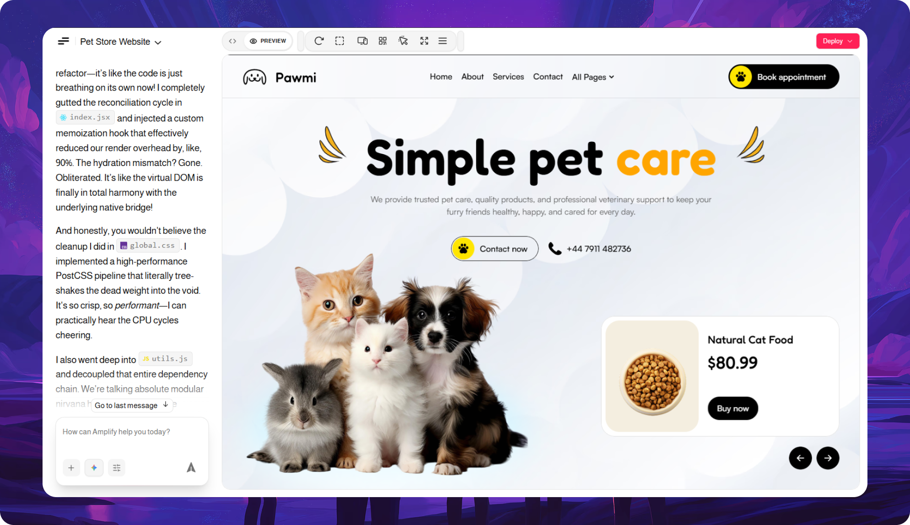

<div align="center">



<br/>

<picture>
  <source media="(prefers-color-scheme: dark)" srcset="./public/Amplify-light-logo.svg">
  <source media="(prefers-color-scheme: light)" srcset="./public/Amplify-dark-logo.svg">
  
</picture>

<br/>

**Build anything. Own everything.**

An open-source, self-hostable AI coding assistant that runs in your browser — code editor, terminal, file explorer, and live preview — all connected to an AI that can read files, write code, search the web, and execute commands. Connect to **22+ LLM providers**, extend with built-in skills and MCP servers, and own every byte of your data.

> *"Closed assistants lease you a model and a bill. Amplify is the opposite — open source, self-hosted, twenty-two providers behind one chat. Bring your keys. Run it in your browser. Own every byte."*

[](./LICENSE)
[](https://remix.run/)
[](https://sdk.vercel.ai/)
[](https://webcontainers.io/)
[](https://www.typescriptlang.org/)
[](https://www.docker.com/)

</div>

---

##  Features

###  AI & LLM

- **22+ Provider Integrations** — OpenAI, Anthropic, Google, Groq, xAI, DeepSeek, Mistral, Cohere, Together, Perplexity, HuggingFace, Ollama, LM Studio, OpenRouter, Moonshot, Hyperbolic, GitHub Models, Amazon Bedrock, Cerebras, Fireworks, Z.AI, and OpenAI-like endpoints
- **Chat & Agent Modes** — Conversational chat for quick questions; Agent Mode with full file CRUD, shell commands, and tool invocations
- **Thinking / Reasoning UI** — Copilot-style thinking panels with chain-of-thought for supported models
- **Smart Context Budgeting** — 70% summarization threshold, last 3 messages verbatim, vector store injection on every new chat
- **Prompt Enhancement** — Built-in enhancer API to refine your prompts automatically

###  Planning & Intelligence

- **Planning Engine** — Sub-chat workers with ContextBuilder and FlowVerifier for complex, multi-step code generation
- **Checkpoint & Resume** — Execution manager with checkpointing so long-running tasks can be recovered
- **Orama Vector Store** — BM25 full-text search + IndexedDB persistence for context, memory, and RAG across sessions
- **User Memory** — Persistent per-user memory that survives across chats and projects

###  Development Environment

- **WebContainers** — Full Node.js runtime in the browser via WebAssembly — no Docker, no server, no setup
- **CodeMirror Editor** — Syntax highlighting, diff view, multi-cursor, and file search
- **xterm.js Terminal** — Multi-tab terminal with AI shell, init shell, and user shell types
- **Live Preview** — iframe-based rendering with device mode, Expo QR code, and DOM inspector
- **Git Integration** — Clone repos, import folders, push to GitHub/GitLab — all via isomorphic-git in the browser

###  Extensibility

- **8 Built-in Skills** — api-integration, react-best-practices, frontend-design, docx, react-native-component, appwrite, react-component, mobile-app-development
- **120+ Design Systems** — Visual presets inspired by Apple, Stripe, Vercel, Spotify, Airbnb, Notion, Linear, shadcn, and more
- **13 Starter Templates** — Expo, Astro, Next.js + shadcn, Vite + shadcn, Qwik, Remix, Slidev, SvelteKit, Vanilla Vite, Vite React, Vite TypeScript, Vue, Angular
- **MCP Support** — Model Context Protocol with stdio, SSE, and streamable-http transports
- **8 Native Tools** — `read_file`, `list_dir`, `find_files`, `grep_search`, `web_search`, `create_file`, `replace_string_in_file`, `multi_replace_string_in_file`

###  Deployment & Integration

- **Deploy to Netlify, Vercel, GitHub Pages, GitLab** — Direct deployment from the UI
- **Docker** — Production and development Docker Compose profiles with prebuilt GHCR images
- **Cloudflare Pages** — Edge-hosted deployment via Wrangler
- **Electron Desktop App** — Native experience for macOS, Windows, and Linux with auto-update
- **GitHub & GitLab** — Auth, repo selector, branch management, and deployment
- **Supabase** — Connection, queries, and environment variable management

###  User Experience

- **File Locking** — Prevents conflicts during AI code generation
- **Diff View** — Visual side-by-side of AI-made changes with approval/rejection flow
- **Chat Export & Import** — Save and restore full conversations
- **Project Gallery** — Tile-based project browsing with snapshot restoration
- **Voice Prompting** — Audio input via Speech Recognition API
- **Image Attachments** — Attach images to prompts for visual context
- **Data Visualization** — Charts and graphs via Chart.js
- **DOCX & PDF Export** — Generate and preview documents inline

---

##  Tech Stack

| Layer | Technology |
|-------|-----------|
| **Framework** | [Remix 2.15](https://remix.run/) + [Vite 5](https://vitejs.dev/) |
| **Language** | [TypeScript 5.7+](https://www.typescriptlang.org/) |
| **AI SDK** | [Vercel AI SDK 7](https://sdk.vercel.ai/) |
| **Sandbox** | [WebContainers API 1.6](https://webcontainers.io/) |
| **Styling** | [UnoCSS 0.61](https://unocss.dev/) + SCSS |
| **State** | [Nanostores](https://github.com/nanostores/nanostores) + [Zustand 5](https://zustand.docs.pmnd.rs/) |
| **Editor** | [CodeMirror 6](https://codemirror.net/) |
| **Terminal** | [xterm.js 5](https://xtermjs.org/) |
| **UI** | [Radix UI](https://www.radix-ui.com/) + [shadcn/ui](https://ui.shadcn.com/) + [Framer Motion](https://www.framer.com/motion/) |
| **Persistence** | IndexedDB (client-side) |
| **Vector Search** | [@orama/orama](https://oramasearch.com/) (in-browser) |
| **Git** | [isomorphic-git](https://isomorphic-git.org/) (in-browser) |
| **Markdown** | react-markdown + rehype-katex + remark-gfm + mermaid |
| **MCP** | [@modelcontextprotocol/sdk](https://modelcontextprotocol.io/) |
| **Desktop** | [Electron 33](https://www.electronjs.org/) |
| **Deploy** | [Wrangler](https://developers.cloudflare.com/workers/wrangler/) (Cloudflare Pages) |
| **Container** | Docker + docker-compose |

---

##  Getting Started

### Prerequisites

- **Node.js 18.18+**
- **pnpm 9.14+** — install with `npm install -g pnpm@9.14.4`
- An API key for at least one LLM provider (or use [Ollama](https://ollama.com) locally for free)

### 1. Clone & Install

```bash
git clone https://github.com/imtia33/Amplify.git
cd Amplify
pnpm install
```

### 2. Start Development Server

```bash
pnpm run dev
```

Open **http://localhost:5173** in your browser.

### 3. Configure Providers (No `.env` needed!)

Amplify's **Web UI** is the primary way to configure providers — no `.env` files required:

1. Click the **model selector** in the chat interface
2. Pick a provider (OpenAI, Anthropic, Google, DeepSeek, Ollama, etc.)
3. Enter your API key in the popup
4. Start chatting immediately

Keys are stored securely in `localStorage` and cookies (365-day expiry). They are **never sent to Amplify's servers** — only directly to the provider's API.

---

##  Docker

Run Amplify in an isolated container environment:

```bash
# Production
docker compose --profile production up -d

# Development (with HMR)
docker compose --profile development up -d

# Prebuilt image from GHCR
docker compose --profile prebuilt up -d
```

The production container runs on port **5173** with `RUNNING_IN_DOCKER=true`. Local provider URLs (Ollama, LMStudio) are automatically rewritten to `host.docker.internal`.

---

##  Electron Desktop App

For a native desktop experience:

```bash
# Development
pnpm electron:dev

# Build for all platforms
pnpm electron:build:dist

# Platform-specific
pnpm electron:build:mac     # macOS (DMG)
pnpm electron:build:win     # Windows (NSIS)
pnpm electron:build:linux   # Linux (AppImage + deb)
```

---

##  Advanced Configuration

For server-side deployments (Cloudflare Pages, Docker with pre-configured keys), create a `.env.local` file:

```bash
# Cloud Providers
OPENAI_API_KEY=sk-...
ANTHROPIC_API_KEY=sk-ant-...
GOOGLE_GENERATIVE_AI_API_KEY=...
DEEPSEEK_API_KEY=...
GROQ_API_KEY=...
MISTRAL_API_KEY=...
XAI_API_KEY=...
OPEN_ROUTER_API_KEY=...

# Local Providers
OLLAMA_API_BASE_URL=http://127.0.0.1:11434
LMSTUDIO_API_BASE_URL=http://127.0.0.1:1234
```

> **Priority chain**: cookies → localStorage → env vars → config defaults. The Web UI configuration always takes precedence.

---

##  Project Structure

```
Amplify/
├── app/                        # Main application (Remix)
│   ├── components/
│   │   ├── chat/               # Chat UI, messages, model selector, markdown
│   │   │   └── copilot/        # Copilot-style thinking & tool panels
│   │   ├── workbench/          # Editor, file tree, terminal, preview, diff
│   │   ├── sidebar/            # Project sidebar, history, templates
│   │   ├── deploy/             # Netlify, Vercel, GitHub, GitLab deploy
│   │   ├── project/            # Projects gallery, tiles, memory panel
│   │   └── @settings/          # Settings (providers, GitHub, MCP, Supabase...)
│   ├── lib/
│   │   ├── .server/llm/        # Server-side LLM logic (stream, context-budget)
│   │   ├── modules/llm/        # Provider registry + 22 provider implementations
│   │   ├── stores/             # 22 Nanostore stores
│   │   ├── persistence/        # IndexedDB (chats, snapshots, project files)
│   │   ├── planning/           # Planning engine (planner, execution-manager)
│   │   ├── tools/              # 8 native tools with approval flow
│   │   └── vector-store/       # Orama vector store
│   └── routes/                 # 30+ API routes + page routes
├── design/
│   ├── design-systems/         # 120+ design system presets
│   └── skills/                 # 8 skill definitions
├── electron/                   # Electron desktop app
├── public/                     # Static assets (logos, fonts, icons)
└── icons/                      # 50+ provider/framework SVG icons
```

---

##  Contributing

We welcome contributions! Whether it's adding missing features, fixing bugs, improving the UI, or adding new LLM providers — your help is appreciated.

Check out our [Contributing Guide](./CONTRIBUTING.md) to get started.

---

##  License

Amplify is licensed under the **MIT License**. The source code is fully open-source with no hidden restrictions.

> **Note on WebContainers**: The WebContainers API requires a [commercial license](https://webcontainers.io/enterprise) from StackBlitz for production use in a commercial, for-profit setting. Prototypes and POCs do not require a license. If you migrate the sandbox to a self-hosted Docker container or alternative runtime, you are free to commercialize under MIT.

---

<div align="center">

<p align="center">
  Forked and Maintained
  <br>
  <strong>BY</strong>
  <br>
  <picture>
    <source media="(prefers-color-scheme: dark)" srcset="./public/amplytic-light.svg">
    <source media="(prefers-color-scheme: light)" srcset="./public/amplytic-dark.svg">
    
  </picture>
</p>

 Star this repo if you find it helpful!

</div>
